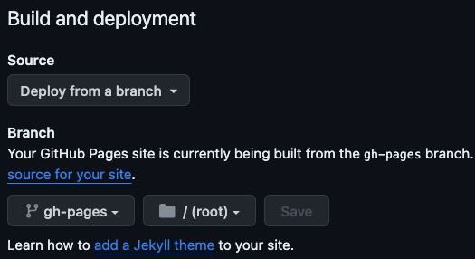

# Restaurant Page

This project is a practical exploration of Webpack configuration and Tailwind CSS integration, building upon The Odin Project's Restaurant Page. The primary focus is on setting up and understanding the differences in Webpack configurations for development and production environments, as well as integrating Tailwind CSS for styling, and an intro to GitHub Actions. 

Check out the live version here: [Restaurant Page Demo](https://kevinweejh.github.io/restaurant/).


## Project Overview

### Purpose

This project is designed to familiarize myself with extended Webpack configuration and Tailwind CSS integration. It demonstrates how to handle different build requirements for development and production environments in Webpack and effectively configure Tailwind CSS in a web development project. As an add-on, this project provided an opportunity to learn about deployment via GitHub Actions.

### Key Features

- Use of ES6 modules for JavaScript code organization.
- Extended Webpack configuration with separate setups for development and production.
- Integration of Tailwind CSS within the Webpack environment.
- Use of GitHub Actions to build and deploy to GitHub Pages.

## Technical Details

### Webpack Configuration

#### webpack.common.js

- Defines the entry point and bundle output settings for the `/dist` directory, including `clean: true` for cleaning the directory on each build.
- Configuration of the HtmlWebpackPlugin for projects with more complex HTML requirements.
- Rules for image asset management.

#### webpack.dev.js

- Merges with `webpack.common.js`, adding development-specific settings like devServer configuration.
- CSS handling rules using `style-loader`, `css-loader`, and `postcss-loader`.

#### webpack.prod.js

- Merges with `webpack.common.js`, employing `MiniCssExtractPlugin` for CSS extraction and `CssMinimizerPlugin` for CSS compression.

### Optimizations

- Image optimization in both development and production setups.
- CSS file extraction and minification in production, using `MiniCssExtractPlugin` and `CssMinimizerPlugin`.
- Built-in JavaScript minification with `TerserWebpackPlugin`, default with Webpack 5+ out of the box when `mode: 'production'` is set. Note: No additional setup is required for basic usage.

### Tailwind CSS Integration

- Follows standard installation and setup procedures as per the [Tailwind CSS documentation](https://tailwindcss.com/docs/installation/using-postcss).
- Tailwind classes can be added statically in HTML or dynamically in JavaScript files. They are scanned using Regex as specified in the Tailwind configuration.
- The `./style.css` file, containing Tailwind directives, should be imported only once in the entry point JavaScript file. Do not link this stylesheet directly in the HTML template or other modules.
- Caution: Avoid including any CSS output files in the `/src` directory targeted by the Tailwind `content` configuration to prevent an infinite rebuilding loop.

### GitHub Actions Deployment

- GitHub Actions is used by way of the `deploy.yml` file nested in the `.github/workflows` directory. 
- Deploying in this manner allows the generated contents of the `/dist` directory to be kept out of the repo, which has the following benefits:
  - Reduce repo size
  - Avoid merge conflicts of the generated files

## Setup and Installation

### Prerequisites

Node.js v21.1.0

### Installation

```bash
npm install
```

### Running the Project

#### For development:

```bash
npm start
```

#### For production:

```bash
npm run build
```

## Usage and Examples

### Deploying using GitHub Actions

This is done by adding a YAML file which really reads as step-by-step instructions for GitHub Actions to perform, as follows: 
```yml
# .github/workflows/deploy.yml
name: Build and Deploy to GitHub Pages

on:                 # Workflow triggered on detection 
  push:             # of push events made to
    branches:       # ...     
      - main        # the main branch

permissions:        # Workflow provided with permission
  contents: write   # to write changes, e.g. Save generated output files

jobs:
  build-and-deploy:
    runs-on: ubuntu-latest

    steps:
      - name: Checkout 🛎️                               # Checkout files from repo
        uses: actions/checkout@v4                       # by using this GitHub Action

      - name: Install Dependencies 🌐                   # Install dependencies 
        run: npm install                                # by running this command

      - name: Build 🔧                                  # Generate dist directory content
        run: npm run build                              # by running this command

      - name: Deploy 🚀                                 # Deploy my site
        uses: JamesIves/github-pages-deploy-action@v4   # by using this GitHub Action
        with:     
          folder: dist                                  # by pushing dist directory content
          branch: gh-pages                              # to the gh-pages branch
          
```


Once this 'workflow' file is committed and pushed to your repo on GitHub, and you have configured your project to deploy using the `gh-pages` branch, the build + deployment process begins automagically. 

And voilà - your project is up on GitHub Pages. Any new changes pushed to the `main` branch will trigger the process to repeat, and GitHub Pages will serve the newly generated contents of the `gh-pages` branch.


## Contribution and Support

### Contributing

While this project is primarily a personal learning exercise, I welcome anyone interested in using it for their learning or experimenting. Feel free to fork the repository, try out different configurations, and share your findings. If you have suggestions for improvements or new features, please open an issue or submit a pull request.

### Support

For questions regarding the setup and configuration of this project, feel free to reach out to me at [kevinweejh@gmail.com](mailto:kevinweejh@gmail.com) or [hello@codebykevin.dev](mailto:hello@codebykevin.dev). I'll be more than happy to provide guidance or discuss the learning aspects of this project.

## Acknowledgements and References

This project draws inspiration from [The Odin Project](https://www.theodinproject.com/lessons/node-path-javascript-restaurant-page) and utilizes resources from [Tailwind CSS](https://tailwindcss.com/docs/installation) and [Webpack](https://webpack.js.org/guides/) documentation, [GitHub Pages Deploy Action](https://github.com/JamesIves/github-pages-deploy-action) for deployment, along with third-party plugins like [MiniCssExtractPlugin](https://webpack.js.org/plugins/mini-css-extract-plugin/), [css-minimizer-webpack-plugin](https://webpack.js.org/plugins/css-minimizer-webpack-plugin/), and [HtmlWebpackPlugin](https://webpack.js.org/plugins/html-webpack-plugin/).